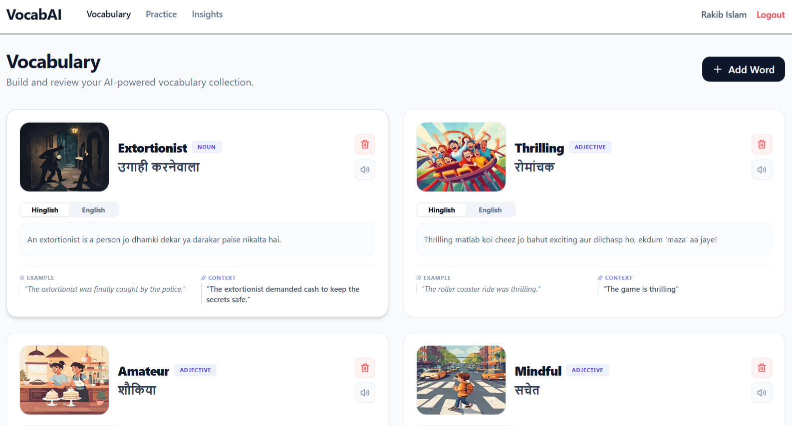

# VocabAI

An AI-powered vocabulary learning platform designed to help users build, retain, and review vocabulary through personalized learning, intelligent enrichment, structured review sessions, and progress tracking.

---

## Live Demo

**Frontend:** https://vocab-ai-blush.vercel.app

**Backend API:** https://vocabai-api.onrender.com

---

## Preview



---

## Project Overview

Learning new vocabulary is easy. Remembering it weeks later is difficult.

Most vocabulary tools focus on collecting words but provide limited support for long-term retention. VocabAI was built to address that problem by combining vocabulary management, AI-generated learning content, structured review workflows, and learning analytics into a single application.

Users can save words, explore contextual information, generate visual associations, complete review sessions, and track learning progress through insights and activity metrics.

---

## Features

### Authentication & Security

- User registration and login
- JWT-based authentication
- Refresh token workflow
- HTTP-only cookie storage
- Protected routes
- Password reset via email
- Session persistence across refreshes

### Vocabulary Management

- Save vocabulary words
- Search vocabulary
- Sort vocabulary entries
- View detailed word information
- Personal vocabulary collection

### AI Vocabulary Enrichment

- AI-generated definitions
- Example sentences
- Synonyms and antonyms
- Contextual explanations
- AI-generated vocabulary images
- Enhanced vocabulary learning experience

### Review System

- Structured review sessions
- Multiple question formats
- Performance tracking
- Review attempt history
- Learning reinforcement workflow

### Insights & Analytics

- Learning activity tracking
- Vocabulary growth metrics
- Review performance insights
- Streak tracking
- Progress visualization

### User Experience

- Responsive design
- Toast notifications
- Skeleton loading states
- Optimistic UI updates
- React Query caching

---

## Architecture

### Frontend

```text
React
│
├── React Router
├── React Query
├── Zustand
├── React Hook Form
├── Axios
└── Tailwind CSS
```

### Backend

```text
Express.js
│
├── Controllers
├── Services
├── Routes
├── Middlewares
├── JWT Authentication
└── Prisma ORM
```

### Database

```text
PostgreSQL
│
└── Neon
```

### External Services

```text
Google Gemini
Cloudinary
Resend
```

---

## Authentication Flow

```text
User Login
      │
      ▼
Access Token Generated
      │
      ▼
Refresh Token Generated
      │
      ▼
HTTP-Only Cookies
      │
      ▼
Protected API Requests
      │
      ▼
Automatic Token Refresh
```

---

## Technology Stack

### Frontend

- React
- Vite
- React Router
- React Query
- Zustand
- Axios
- React Hook Form
- Zod
- Tailwind CSS
- Recharts

### Backend

- Node.js
- Express.js
- Prisma ORM
- JWT
- Helmet
- Morgan
- Winston
- Cookie Parser

### Database

- PostgreSQL
- Neon

### Cloud & Integrations

- Google Gemini
- Cloudinary
- Resend

### Deployment

- Vercel (Frontend)
- Render (Backend)
- Neon (Database)

---

## Database Design

Core entities include:

- User
- Vocabulary
- UserWord
- ReviewSession
- ReviewAttempt

The schema is designed to support scalable vocabulary management, personalized learning, and review tracking.

---

## Deployment Architecture

```text
Frontend (Vercel)
        │
        ▼
Backend API (Render)
        │
        ▼
PostgreSQL Database (Neon)
```

---

## Challenges Solved

During development, the following production-level concerns were addressed:

- Refresh token authentication
- Secure cookie handling
- CORS configuration
- React Query cache synchronization
- Password reset workflow
- Environment variable management
- Database migration deployment
- AI service integration
- Production deployment configuration

---

## Future Improvements

Planned enhancements include:

- Vocabulary difficulty scoring
- Personalized learning recommendations
- Flashcard mode
- Daily learning goals
- Mobile application
- Advanced analytics dashboard
- Social learning features

---

## Local Development

### Clone Repository

```bash
git clone <repository-url>
```

### Install Frontend Dependencies

```bash
cd frontend
npm install
```

### Install Backend Dependencies

```bash
cd backend
npm install
```

### Configure Environment Variables

Create `.env` files for both frontend and backend using the required environment variables.

### Run Development Servers

Frontend:

```bash
npm run dev
```

Backend:

```bash
npm run dev
```

---

## Project Structure

```text
VocabAI
│
├── frontend
│   ├── src
│   ├── assets
│   ├── modules
│   └── components
│
├── backend
│   ├── prisma
│   ├── src
│   │   ├── routes
│   │   ├── middlewares
│   │   ├── services
│   │   ├── controllers
│   │   └── modules
│   └── config
│
└── README.md
```

---

## Author

**Rakib Islam**

Built as a full-stack portfolio project focused on:

- Authentication systems
- AI-powered learning workflows
- Cloud deployment
- Database design
- Backend architecture
- Modern React applications